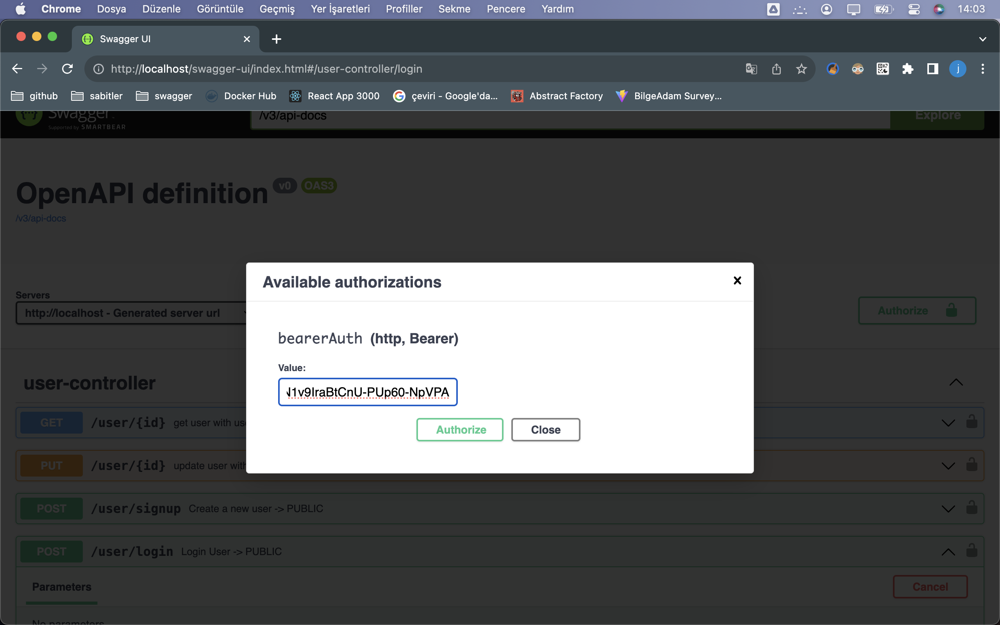
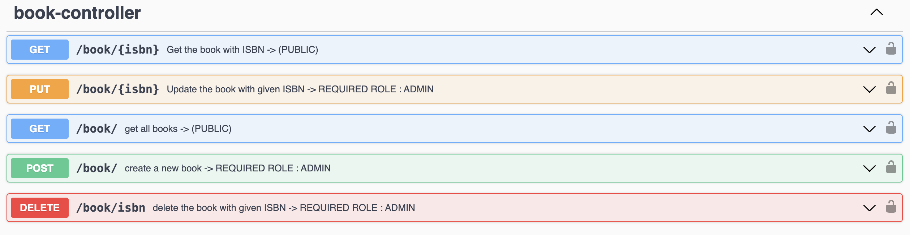
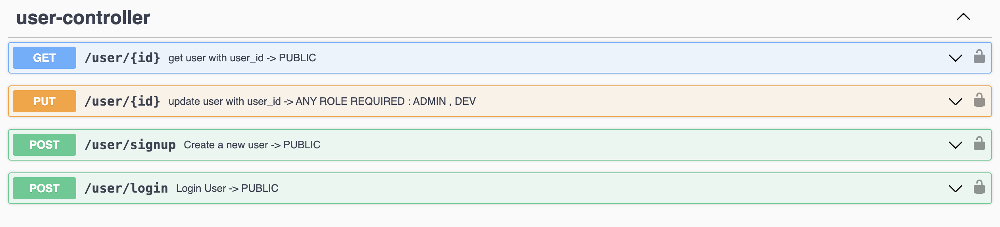
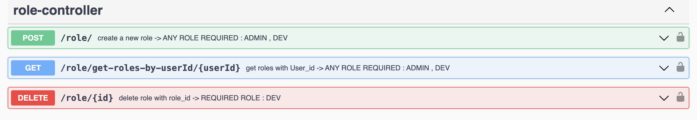
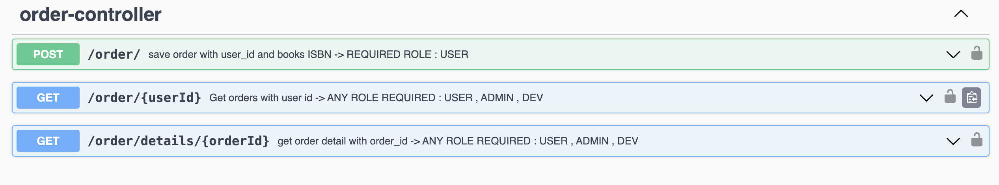

---
- Create a **oredataDB** PostgreSql or MySql

### DataBase Configuration: open; resources-> application.yml
    -   for PostgreSql:    
    -     driver-class-name: org.postgresql.Driver
    -   for MySql:
          driver-class-name: com.mysql.cj.jdbc.Driver

 
    -     PostgreSql
          url: jdbc:postgresql://localhost:5432/oredataDB
    -     MySql
          url: jdbc:mysql://localhost:3306/oredataDB

    -     username: postgres -> DB username for postgre or mysql
          password: ******** -> DB password

---
### Regex was not added to make testing easier.
### When the program first runs: A new role and admin are automatically created.
- Role:
  - ADMIN
- USER:
  - email:admin
  - password: admin
  - role: ADMIN
### To create a new user: a new role must be created first. The user must be created by assigning this role to the user.
### After the login process, paste the bearer token given into the authorize section in Swagger.

### http://localhost/swagger-ui/index.html

---
### Book Document

- There cannot be books with the same ISBN.
- If a book has been sold, the book cannot be deleted.

---
### User Document

- If the book copy is 0, the book cannot be purchased.
- There cannot be users with the same e-mail address.

### Role Document

### Order Document

